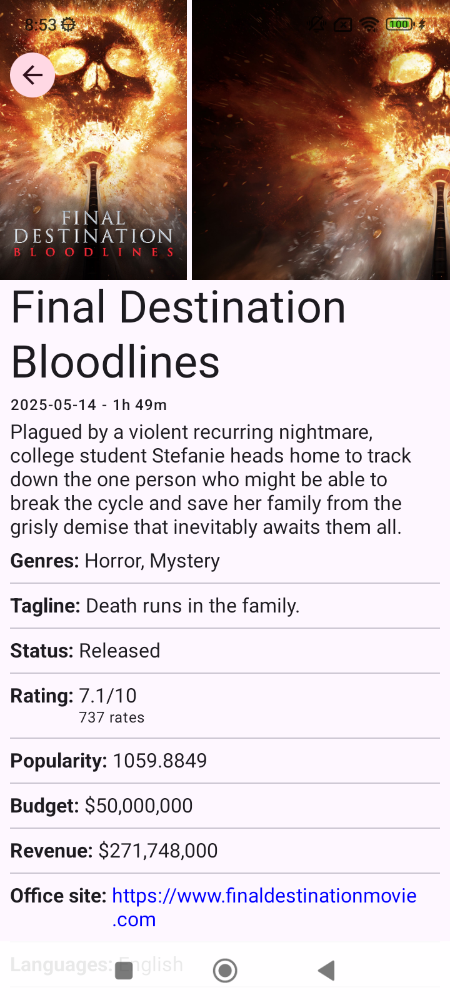
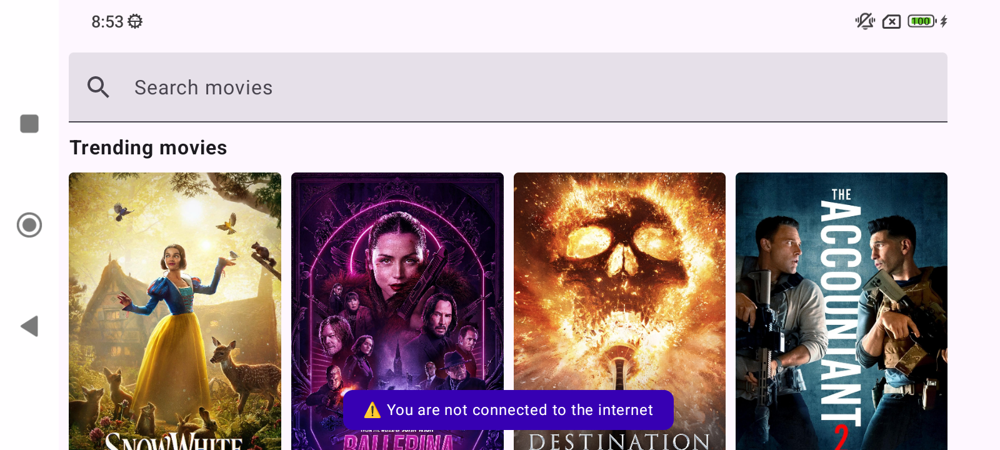

# The Movie (KMM Project)

"The Movie" is a Kotlin Multiplatform Mobile (KMM) application that allows users to discover trending movies, search for movies, and view movie details. It showcases how to build cross-platform applications with shared business logic and platform-specific UIs.

## Features

- View a list of currently trending movies.
- Search for movies by title.
- View detailed information about a selected movie.
- Caching of data for offline access and improved performance.

## Tech Stack

- **Kotlin:** Primary language for shared business logic.
- **Coroutines:** For asynchronous programming (managing background tasks, network requests).
- **Flow:** For reactive data streams, especially for data from network/database to ViewModels.
- **Ktor Client:** For making HTTP requests to The Movie Database (TMDb) API.
  - Content Negotiation (kotlinx.serialization) for JSON parsing.
  - Auth (Bearer Token) for API authentication.
  - Logging for network request/response inspection.
  - Resources for type-safe routing.
- **SQLDelight:** For local database storage (caching movie data).
- **Multiplatform DataStore:** For simple key-value storage (last sync timestamps).
- **Kotlinx Serialization:** For JSON parsing and serialization.
- **Kotlinx DateTime:** For multiplatform date and time manipulation.
- **Manual Dependency Injection**
- **Jetpack Compose:** For building the native UI declaratively.
- **Material 3 Design:** Modern UI components and theming.
- **Android Jetpack:**
  - **ViewModel:** For UI-related data holder, lifecycle-aware.
  - **Navigation Compose:** For navigating between screens/composables.
- **Coil:** For asynchronously loading and displaying movie poster images.

## Prerequisites

Create the local.properties file in the project's root folder. This file contains your API key:

```
apiKey=your_api_key
```

## Checklist

- ✅ Get the trending movies for
- ✅ Trending movies should work offline after loading once (refresh after 24 hours)
- ✅ Search movie when the search field text is not empty
- ✅ Show all movie information on detail sreen.
- ✅ Allow any hyperlinks to be opened.
- ✅ Work offline if movie details are opened once before (refresh after 24 hours)
- ✅ Use the latest Jetpack architecture recommendations by Google
- ✅ Shared code is iOS-friendly
- ✅ Create Unit Tests to make sure caching validation is handled correctly.
- ✅ Create a simple UI Test.
- ✅ Error message handling (offline/online/failed API calls with specific screen).
- ✅ Display content edge-to-edge

## Demo

[Youtube](https://www.youtube.com/playlist?list=PLnBRK1vmLxkvYMZd8Gtjd-869IL2A2ROR)





